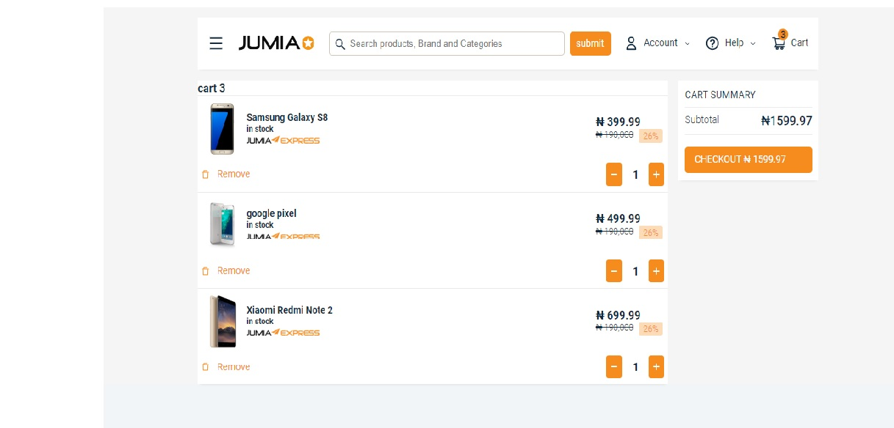

E-Commerce Cart
This project is a simple implementation of an e-commerce cart using React and Redux. The project consists of two components, CartContent and CartSummary, which are used to display the cart items and the total cost respectively.

## site preview

## Demo

You can see a live demo of the Stripe navigation bar clone [here](https://pascalproject-jumia-cart.netlify.app/).

## Features
Add items to the cart   
Remove items from the cart
Increase or decrease the quantity of items in the cart   
Display the total cost of items in the cart   

## Installation
To run this project, you need to have Node.js and NPM installed on your computer. 
Clone the repository to your local machine
Install the dependencies using the command npm install
Start the development server using the command npm start
The project will be running at http://127.0.0.1:5173 in your browser.

## Usage
The CartContent component is responsible for displaying the cart items. It contains the logic for adding, removing, and updating the quantity of items in the cart. The CartSummary component is responsible for displaying the total cost of items in the cart.

The project uses Redux to manage the state of the cart. The cartSlice file contains the Redux slice for the cart, which includes the initial state, actions, and reducers.

## ontributing
Contributions are welcome! If you find any bugs or have suggestions for new features, please open an issue or submit a pull request.

## License
This project is licensed under the MIT License. Feel free to use, modify, and distribute the code as you see fit.
